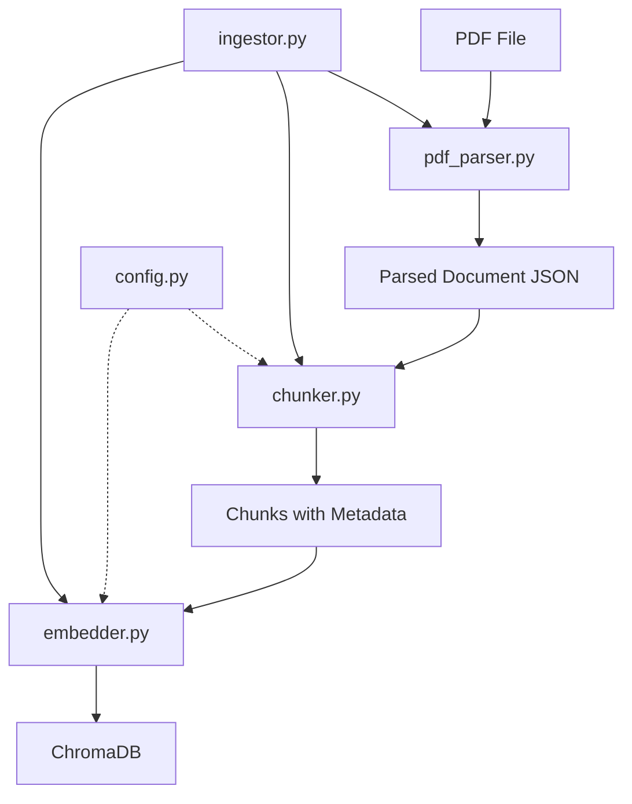

# Design Document: Page-Wise Chunking

## Overview

This design document specifies the implementation of a page-wise chunking strategy for the IRDAI Public Disclosure PDF analyzer. The current system uses text-based chunking that splits documents into overlapping chunks of ~1000 characters, which breaks semantic coherence by fragmenting complete tables and related text that naturally belong together on a single page.

### Problem Statement

The existing text-based chunking approach has several limitations:

1. **Semantic Fragmentation**: Tables and related text are split across multiple chunks, breaking contextual relationships
2. **High Chunk Count**: ~1,820 chunks across 6 companies creates retrieval inefficiency
3. **Poor Retrieval Accuracy**: Related information scattered across chunks reduces answer quality
4. **L-page Misalignment**: IRDAI L-page identifiers (L-1, L-2, etc.) map to complete pages, but chunks don't respect these boundaries

### Solution Approach

The page-wise chunking strategy treats each PDF page as a single semantic unit, creating one chunk per page by default. This approach:

- **Preserves Semantic Coherence**: All tables and text from a page stay together
- **Reduces Chunk Count**: From ~1,820 to ~300-400 chunks (75-80% reduction)
- **Aligns with L-pages**: Each chunk corresponds to a complete L-page section
- **Improves Retrieval**: Complete context available in single chunk

### Key Design Decisions

1. **Page as Primary Unit**: Each page becomes one chunk, combining all tables and text_blocks
2. **Token Limit Handling**: Pages exceeding 8000 tokens are split into sub-chunks with intelligent boundaries
3. **Configuration-Driven**: Feature flag (PAGE_WISE_CHUNKING) enables switching between strategies
4. **Backward Compatible**: Existing metadata schema and chunk structure preserved
5. **Table Integrity**: Tables kept intact when possible; split by rows with repeated headers if necessary

## Architecture

### Module Relationships



### Data Flow

1. **PDF Parsing** (pdf_parser.py):
   - Input: PDF file
   - Output: Parsed document with pages array
   - Each page contains: page_number, page_label (L-page), section, tables[], text_blocks[]

2. **Chunking** (chunker.py):
   - Input: Parsed document
   - Output: List of chunks (text + metadata)
   - Strategy determined by PAGE_WISE_CHUNKING config flag

3. **Embedding** (embedder.py):
   - Input: Chunks
   - Output: Vector embeddings stored in ChromaDB
   - Batch processing for efficiency

4. **Orchestration** (ingestor.py):
   - Coordinates the full pipeline
   - Handles force_reindex for re-processing

### Configuration Architecture

The config.py module will be extended with new settings:

```python
# New page-wise chunking settings
PAGE_WISE_CHUNKING = bool(os.getenv("PAGE_WISE_CHUNKING", "True"))
MAX_PAGE_TOKENS = int(os.getenv("MAX_PAGE_TOKENS", "8000"))

# Existing settings (preserved for backward compatibility)
CHUNK_SIZE = int(os.getenv("CHUNK_SIZE", "1200"))
CHUNK_OVERLAP = int(os.getenv("CHUNK_OVERLAP", "150"))
MIN_CHUNK_SIZE = int(os.getenv("MIN_CHUNK_SIZE", "100"))
```

## Components and Interfaces

### 1. Chunker Module (src/chunker.py)

#### New Functions

**`_estimate_tokens(text: str) -> int`**
- Estimates token count using char_count / 4 approximation
- Used to determine if page exceeds MAX_PAGE_TOKENS
- Returns: Integer token count

**`_combine_page_content(page: Dict[str, Any]) -> str`**
- Combines all tables and text_blocks from a page into single text
- Format: tables first (pipe-separated), then text_blocks, separated by "\n\n"
- Returns: Combined text string

**`_split_page_into_subchunks(page: Dict[str, Any], base_metadata: Dict[str, Any], max_tokens: int) -> List[Dict[str, Any]]`**
- Splits oversized pages into sub-chunks
- Keeps tables intact when possible
- Splits tables by rows with repeated headers if necessary
- Splits text_blocks at sentence boundaries
- Returns: List of sub-chunk dictionaries

**`_chunk_page_wise(parsed_doc: Dict[str, Any], additional_metadata: Dict[str, Any]) -> List[Dict[str, Any]]`**
- Main page-wise chunking logic
- Creates one chunk per page by default
- Calls _split_page_into_subchunks for oversized pages
- Returns: List of chunks

#### Modified Functions

**`chunk_document(parsed_doc: Dict[str, Any], additional_metadata: Dict[str, Any] = None) -> List[Dict[str, Any]]`**
- Add strategy selection based on PAGE_WISE_CHUNKING flag
- If True: call _chunk_page_wise()
- If False: use existing text-based logic
- Maintains existing function signature for backward compatibility

#### Chunk Structure

Page-wise chunks maintain the existing two-key structure:

```python
{
    "text": str,  # Combined page content
    "metadata": {
        "company": str,
        "company_code": str,
        "quarter": str,
        "fy": str,
        "period_label": str,
        "source_file": str,
        "chunk_id": str,  # Format: {company_code}_{quarter}_{fy}_page{page_number}
        "page_number": int,
        "page_label": str,  # L-page identifier
        "section": str,
        "content_type": str,  # "page" for page-wise chunks
        "char_count": int,
        "ingested_at": str,  # ISO 8601 timestamp
        "table_count": int,  # Number of tables on page
        "text_block_count": int,  # Number of text blocks on page
        "is_split": bool,  # True if page was split into sub-chunks
        "total_parts": int,  # Only present if is_split=True
        "part_number": int,  # Only present if is_split=True
    }
}
```

### 2. Config Module (src/config.py)

#### New Configuration Parameters

| Parameter | Type | Default | Description |
|-----------|------|---------|-------------|
| PAGE_WISE_CHUNKING | bool | True | Enable page-wise chunking strategy |
| MAX_PAGE_TOKENS | int | 8000 | Maximum tokens per chunk (embedding model limit) |

#### Environment Variables

Add to .env file:
```bash
# Page-wise chunking settings
PAGE_WISE_CHUNKING=True
MAX_PAGE_TOKENS=8000
```

### 3. Ingestor Module (src/ingestor.py)

#### Modified Functions

**`ingest_pdf(pdf_path: str, force_reindex: bool = False) -> Dict[str, Any]`**
- No changes required to function signature
- force_reindex parameter already supports re-processing
- Will automatically use new chunking strategy based on config

**`ingest_directory(directory_path: str, force_reindex: bool = False) -> Dict[str, Any]`**
- No changes required
- Batch processing works with both chunking strategies

### 4. Embedder Module (src/embedder.py)

#### No Changes Required

The embedder module works with both chunking strategies because:
- Chunk structure (text + metadata) remains unchanged
- Metadata schema is backward compatible
- Batch embedding works regardless of chunk size
- ChromaDB storage logic is strategy-agnostic

### 5. PDF Parser Module (src/pdf_parser.py)

#### No Changes Required

The pdf_parser already provides the necessary structure:
- Pages array with page_number, page_label, section
- Tables and text_blocks arrays per page
- L-page index extraction and mapping

## Data Models

### Parsed Document Schema (from pdf_parser)

```python
{
    "company": str,
    "company_code": str,
    "quarter": str,
    "fy": str,
    "period_label": str,
    "source_file": str,
    "total_pages": int,
    "page_definitions_found": bool,
    "pages": [
        {
            "page_number": int,
            "page_label": str,  # e.g., "L-1", "L-5"
            "section": str,  # e.g., "Revenue Account", "Balance Sheet"
            "tables": [
                {
                    "headers": List[str],
                    "rows": List[List[str]],
                    "raw_text": str
                }
            ],
            "text_blocks": List[str]
        }
    ]
}
```

### Chunk Metadata Schema

#### Page-Wise Chunk Metadata

```python
{
    "company": str,  # e.g., "HDFC Life"
    "company_code": str,  # e.g., "HDFC_Life"
    "quarter": str,  # e.g., "Q1", "Q2", "Q3", "Q4"
    "fy": str,  # e.g., "FY25", "FY26"
    "period_label": str,  # e.g., "Q1 FY2024-25"
    "source_file": str,  # e.g., "HDFC_Life_Q1_FY25.pdf"
    "chunk_id": str,  # Format: {company_code}_{quarter}_{fy}_page{page_number}[_part{n}]
    "page_number": int,  # 1-based page number
    "page_label": str,  # L-page identifier (e.g., "L-1", "L-5")
    "section": str,  # Section name (e.g., "Premium Schedule", "Claims")
    "content_type": str,  # "page" for page-wise chunks
    "char_count": int,  # Total characters in chunk text
    "ingested_at": str,  # ISO 8601 timestamp
    "table_count": int,  # Number of tables on page
    "text_block_count": int,  # Number of text blocks on page
    "is_split": bool,  # True if page was split into sub-chunks
    "total_parts": int,  # Only present if is_split=True (2-20)
    "part_number": int,  # Only present if is_split=True (1-based)
}
```

### Token Estimation Model

```python
def _estimate_tokens(text: str) -> int:
    """
    Estimate token count for embedding model.
    
    The sentence-transformers/all-MiniLM-L6-v2 model uses WordPiece tokenization.
    Empirical testing shows ~4 characters per token on average for English text.
    
    Args:
        text: Input text string
    
    Returns:
        Estimated token count
    """
    return len(text) // 4
```

### Page Splitting Algorithm

```python
def _split_page_into_subchunks(
    page: Dict[str, Any],
    base_metadata: Dict[str, Any],
    max_tokens: int = 7600  # Leave buffer below 8000
) -> List[Dict[str, Any]]:
    """
    Split oversized page into sub-chunks.
    
    Algorithm:
    1. Process tables first (keep intact if possible)
    2. If table exceeds max_tokens, split by rows with repeated headers
    3. Process text_blocks after tables
    4. If text_block exceeds max_tokens, split at sentence boundaries
    5. Accumulate content until max_tokens reached
    6. Create new sub-chunk when threshold exceeded
    
    Constraints:
    - Minimum 2 rows per table sub-chunk (plus headers)
    - Minimum 100 characters per text fragment
    - Maximum 20 sub-chunks per page
    - Reject page if single table row exceeds max_tokens
    
    Returns:
        List of sub-chunk dictionaries with part_number and total_parts
    """
```

## Error Handling

### Error Categories

#### 1. Configuration Errors

**Invalid PAGE_WISE_CHUNKING Value**
- Detection: Non-boolean value in config
- Handling: Default to True, log warning
- Recovery: Continue with page-wise chunking

**Invalid MAX_PAGE_TOKENS Value**
- Detection: Non-integer or value < 1000
- Handling: Default to 8000, log warning
- Recovery: Continue with default value

#### 2. Data Validation Errors

**Missing Pages Array**
- Detection: parsed_doc["pages"] is None or missing
- Handling: Treat as empty array, return empty chunk list
- Logging: Warning level with document identifier

**Missing Tables or Text_Blocks**
- Detection: page["tables"] or page["text_blocks"] is None
- Handling: Treat as empty array, continue processing
- Logging: Debug level (expected for some pages)

**Empty Page Content**
- Detection: No tables and no text_blocks on page
- Handling: Skip page, do not create chunk
- Logging: Debug level with page_number

#### 3. Token Limit Errors

**Unsplittable Table Row**
- Detection: Single table row (with headers) exceeds MAX_PAGE_TOKENS
- Handling: Reject entire page, log error
- Error Message: "Page {page_number} rejected: unsplittable table row exceeds token limit"
- Recovery: Continue processing remaining pages

**Excessive Sub-Chunks**
- Detection: Page would require > 20 sub-chunks
- Handling: Create 20 sub-chunks, truncate remaining content
- Logging: Warning level with page_number and truncated content size

#### 4. Metadata Errors

**Missing Required Metadata Fields**
- Detection: company_code, quarter, or fy missing from parsed_doc
- Handling: Raise ValueError with descriptive message
- Recovery: None (fatal error for document)

**Invalid Page Number**
- Detection: page_number < 1 or not an integer
- Handling: Skip page, log warning
- Recovery: Continue processing remaining pages

### Error Logging Strategy

```python
# Error severity levels
logger.error()   # Fatal errors that prevent processing
logger.warning() # Non-fatal issues that may affect quality
logger.info()    # Normal processing milestones
logger.debug()   # Detailed diagnostic information
```

### Error Response Format

```python
{
    "status": "error",
    "error_type": str,  # "configuration", "validation", "token_limit", "metadata"
    "message": str,  # Human-readable error description
    "page_number": int,  # Optional: affected page
    "source_file": str,  # Document identifier
    "recoverable": bool,  # Whether processing can continue
}
```

## Testing Strategy

### Unit Testing Approach

The testing strategy combines example-based unit tests with integration tests. Property-based testing is **not applicable** for this feature because:

1. **Infrastructure-like behavior**: Chunking is a data transformation pipeline with deterministic outputs for given inputs
2. **Configuration validation**: Testing boolean flags and integer limits is better suited to example-based tests
3. **Integration dependencies**: The feature depends on external modules (pdf_parser, embedder, ChromaDB) that are better tested through integration tests

### Unit Tests (pytest)

#### Test Suite 1: Page-Wise Chunking Logic (5 tests)

**Test 1.1: Single Page with Tables and Text**
- Input: Parsed doc with 1 page, 2 tables, 3 text_blocks
- Expected: 1 chunk with content_type="page", combined content
- Validates: Requirement 1.1, 1.4, 1.5, 1.6

**Test 1.2: Empty Page**
- Input: Parsed doc with 1 page, no tables, no text_blocks
- Expected: 0 chunks, debug log message
- Validates: Requirement 1.2, 5.3

**Test 1.3: Multiple Pages**
- Input: Parsed doc with 5 pages, varying content
- Expected: 5 chunks with sequential page_numbers
- Validates: Requirement 1.1, 1.4

**Test 1.4: Missing Arrays**
- Input: Parsed doc with page missing "tables" key
- Expected: Chunk created with only text_blocks
- Validates: Requirement 1.3

**Test 1.5: Metadata Population**
- Input: Parsed doc with complete metadata
- Expected: All metadata fields present and correct
- Validates: Requirement 1.4, 1.7, 1.8

#### Test Suite 2: Token Limit Handling (3 tests)

**Test 2.1: Page Exceeding Token Limit**
- Input: Page with ~40,000 characters (10,000 tokens)
- Expected: 2-3 sub-chunks with part_number and total_parts
- Validates: Requirement 2.1, 2.5, 2.6

**Test 2.2: Large Table Splitting**
- Input: Page with single table of 100 rows (~12,000 tokens)
- Expected: Multiple sub-chunks with repeated headers
- Validates: Requirement 2.2, 2.3, 2.4

**Test 2.3: Unsplittable Table Row**
- Input: Page with table row exceeding 7600 tokens
- Expected: Page rejected, error logged
- Validates: Requirement 2.11

#### Test Suite 3: Configuration Switching (2 tests)

**Test 3.1: PAGE_WISE_CHUNKING=True**
- Input: Parsed doc with 10 pages
- Expected: ~10 chunks with chunk_id format page{n}
- Validates: Requirement 3.3

**Test 3.2: PAGE_WISE_CHUNKING=False**
- Input: Same parsed doc
- Expected: ~50-100 chunks with legacy chunk_id format
- Validates: Requirement 3.4, 4.5

#### Test Suite 4: Integration Tests (2 tests)

**Test 4.1: End-to-End Pipeline**
- Input: Sample PDF file
- Steps: parse_pdf → chunk_document → embed_chunks → query ChromaDB
- Expected: Chunks stored and retrievable
- Validates: Requirement 4.3, 4.4

**Test 4.2: Force Reindex**
- Input: Already-indexed PDF
- Steps: ingest_pdf with force_reindex=True
- Expected: Old chunks deleted, new chunks created
- Validates: Requirement 4.1, 4.2

#### Test Suite 5: Edge Cases (4 tests)

**Test 5.1: Tables-Only Page**
- Input: Page with 5 tables, no text
- Expected: 1 chunk with table_count=5, text_block_count=0
- Validates: Requirement 6.1, 6.3

**Test 5.2: Text-Only Page**
- Input: Page with no tables, 10 text_blocks
- Expected: 1 chunk with table_count=0, text_block_count=10
- Validates: Requirement 6.2, 6.4

**Test 5.3: Mixed Content Page**
- Input: Page with 2 tables and 5 text_blocks
- Expected: 1 chunk with correct counts
- Validates: Requirement 6.1, 6.2

**Test 5.4: Chunk Quality Validation**
- Input: Page with empty text_blocks and whitespace-only content
- Expected: Chunks with char_count < MIN_CHUNK_SIZE excluded
- Validates: Requirement 5.1, 5.2

### Test Data

**Sample Parsed Document Structure:**
```python
{
    "company": "Test Insurance",
    "company_code": "TEST_INS",
    "quarter": "Q1",
    "fy": "FY25",
    "period_label": "Q1 FY2024-25",
    "source_file": "TEST_INS_Q1_FY25.pdf",
    "total_pages": 3,
    "page_definitions_found": True,
    "pages": [
        {
            "page_number": 1,
            "page_label": "L-1",
            "section": "Revenue Account",
            "tables": [
                {
                    "headers": ["Particulars", "Amount"],
                    "rows": [["Premium Income", "1000"], ["Claims", "500"]],
                    "raw_text": "Particulars | Amount\nPremium Income | 1000\nClaims | 500"
                }
            ],
            "text_blocks": ["This is a test document.", "Revenue details for Q1."]
        }
    ]
}
```

### Test Execution

```bash
# Run all tests
pytest tests/test_page_wise_chunking.py -v

# Run specific test suite
pytest tests/test_page_wise_chunking.py::TestPageWiseChunking -v

# Run with coverage
pytest tests/test_page_wise_chunking.py --cov=src.chunker --cov-report=html
```

### Test Fixtures

```python
@pytest.fixture
def sample_parsed_doc():
    """Fixture providing sample parsed document."""
    return {...}

@pytest.fixture
def large_page():
    """Fixture providing page exceeding token limit."""
    return {...}

@pytest.fixture
def test_chromadb():
    """Fixture providing isolated test ChromaDB instance."""
    # Create temporary ChromaDB
    # Yield collection
    # Cleanup after test
```

### Success Criteria

- All 16 unit tests pass
- Code coverage ≥ 90% for chunker.py modifications
- Integration tests verify end-to-end functionality
- No regressions in existing text-based chunking mode

## Migration Path

### Phase 1: Implementation (Week 1)

**Day 1-2: Core Implementation**
1. Add PAGE_WISE_CHUNKING and MAX_PAGE_TOKENS to config.py
2. Implement _estimate_tokens() function
3. Implement _combine_page_content() function
4. Implement _chunk_page_wise() function
5. Modify chunk_document() to support strategy selection

**Day 3-4: Token Limit Handling**
1. Implement _split_page_into_subchunks() function
2. Add table splitting logic with header repetition
3. Add text_block splitting at sentence boundaries
4. Implement error handling for unsplittable content

**Day 5: Testing**
1. Write unit tests for all new functions
2. Write integration tests
3. Run test suite and fix issues

### Phase 2: Validation (Week 2)

**Day 1-2: Test with Real Data**
1. Run page-wise chunking on existing 6 company PDFs
2. Verify chunk count reduction (target: 75-80%)
3. Validate metadata completeness
4. Check for any rejected pages

**Day 3: Performance Testing**
1. Measure processing time per document
2. Compare with text-based chunking performance
3. Verify batch embedding efficiency
4. Monitor ChromaDB storage size

**Day 4-5: Quality Assurance**
1. Test retrieval accuracy with page-wise chunks
2. Compare RAG pipeline results with text-based chunks
3. Validate L-page alignment
4. Test edge cases (empty pages, large tables, etc.)

### Phase 3: Migration (Week 3)

**Day 1: Backup**
1. Export existing ChromaDB collection
2. Save backup of current chunks
3. Document current system state

**Day 2-3: Re-indexing**
1. Set PAGE_WISE_CHUNKING=True in .env
2. Run ingest_directory with force_reindex=True
3. Monitor progress and log any errors
4. Verify new chunk count and structure

**Day 4: Validation**
1. Run test queries against new chunks
2. Compare retrieval results with baseline
3. Verify all companies and quarters indexed
4. Check metadata completeness

**Day 5: Rollback Plan**
1. If issues found, set PAGE_WISE_CHUNKING=False
2. Re-index with text-based chunking
3. Restore from backup if necessary
4. Document issues for resolution

### Rollback Strategy

**Trigger Conditions:**
- Retrieval accuracy drops > 10%
- Processing errors on > 5% of pages
- Performance degradation > 50%
- Critical metadata missing

**Rollback Steps:**
1. Set PAGE_WISE_CHUNKING=False in .env
2. Delete page-wise chunks from ChromaDB
3. Re-run ingest_directory with force_reindex=True
4. Verify system returns to baseline state
5. Investigate root cause before retry

### Monitoring Metrics

**During Migration:**
- Total chunks created (target: 300-400)
- Pages rejected due to token limits (target: < 1%)
- Processing time per document (target: < 5s)
- Average chunk size (target: 4000-6000 chars)
- Metadata completeness (target: 100%)

**Post-Migration:**
- Retrieval accuracy (compare with baseline)
- Query response time
- User satisfaction with answers
- Error rate in production

## Performance Considerations

### Expected Performance Improvements

1. **Chunk Count Reduction**: 75-80% fewer chunks (1820 → 300-400)
2. **Processing Speed**: Single-pass processing vs. multiple text splits
3. **Retrieval Efficiency**: Fewer chunks to search, more relevant results
4. **Storage Efficiency**: Less metadata overhead per chunk

### Optimization Strategies

1. **Batch Processing**: Already implemented in embedder.py
2. **Single-Pass Chunking**: No redundant iterations over content
3. **Lazy Token Estimation**: Only estimate when page might exceed limit
4. **Efficient String Concatenation**: Use list join instead of += operator

### Resource Usage

**Memory:**
- Peak memory during embedding: ~500MB for 400 chunks
- ChromaDB storage: ~50MB for 400 chunks with embeddings

**CPU:**
- Parsing: ~1-2s per 50-page PDF
- Chunking: ~0.5s per document
- Embedding: ~2-3s per document (batch mode)

**Disk:**
- Parsed JSON: ~2-5MB per document
- ChromaDB: ~100-200KB per document

### Scalability

**Current Scale (6 companies):**
- Total chunks: ~400
- Total documents: 6
- Processing time: ~30s total

**Projected Scale (50 companies):**
- Total chunks: ~3,000
- Total documents: 50
- Processing time: ~4-5 minutes total

**Projected Scale (500 companies):**
- Total chunks: ~30,000
- Total documents: 500
- Processing time: ~40-50 minutes total
- Recommendation: Implement parallel processing for large-scale ingestion

## Implementation Notes

### Code Organization

**New Files:**
- None (all changes in existing files)

**Modified Files:**
1. `src/config.py` - Add PAGE_WISE_CHUNKING and MAX_PAGE_TOKENS settings
2. `src/chunker.py` - Add page-wise chunking functions and strategy selection
3. `.env` - Add new configuration parameters

**No Changes Required:**
- `src/pdf_parser.py` - Already provides necessary page structure
- `src/embedder.py` - Works with both chunking strategies
- `src/ingestor.py` - Already supports force_reindex parameter
- `src/rag_pipeline.py` - Metadata schema remains compatible

### Development Workflow

1. **Feature Branch**: Create `feature/page-wise-chunking` branch
2. **Incremental Commits**: Commit after each major function implementation
3. **Test-Driven Development**: Write tests before implementing complex logic
4. **Code Review**: Review changes before merging to main
5. **Documentation**: Update README.md with new configuration options

### Backward Compatibility Checklist

- [ ] Existing chunk structure (text + metadata) preserved
- [ ] All existing metadata fields maintained
- [ ] Legacy chunking mode (PAGE_WISE_CHUNKING=False) works identically
- [ ] No breaking changes to embedder or ingestor interfaces
- [ ] RAG pipeline filtering logic remains compatible
- [ ] Existing ChromaDB queries work with new chunks

### Configuration Migration

**For New Installations:**
```bash
# .env file
PAGE_WISE_CHUNKING=True
MAX_PAGE_TOKENS=8000
```

**For Existing Installations:**
```bash
# Option 1: Keep text-based chunking (no changes needed)
PAGE_WISE_CHUNKING=False

# Option 2: Migrate to page-wise chunking
PAGE_WISE_CHUNKING=True
MAX_PAGE_TOKENS=8000
# Then run: python scripts/ingest_all.py --force-reindex
```

### Logging Strategy

**Log Levels:**
- `INFO`: Processing milestones (start/end chunking, chunk counts)
- `WARNING`: Non-fatal issues (empty pages, truncated content)
- `ERROR`: Fatal errors (unsplittable content, missing metadata)
- `DEBUG`: Detailed diagnostics (token estimates, split decisions)

**Key Log Messages:**
```python
logger.info("[CHUNKER] Using page-wise chunking strategy")
logger.info("[CHUNKER] Created %d chunks from %d pages", chunk_count, page_count)
logger.warning("[CHUNKER] Page %d split into %d sub-chunks (exceeded token limit)", page_num, part_count)
logger.error("[CHUNKER] Page %d rejected: unsplittable table row exceeds token limit", page_num)
logger.debug("[CHUNKER] Page %d: %d tokens (threshold: %d)", page_num, token_count, max_tokens)
```

### Testing Checklist

**Unit Tests:**
- [ ] Test page-wise chunking with single page
- [ ] Test page-wise chunking with multiple pages
- [ ] Test empty page handling
- [ ] Test missing arrays handling
- [ ] Test metadata population
- [ ] Test token limit handling
- [ ] Test table splitting with header repetition
- [ ] Test text_block splitting at sentence boundaries
- [ ] Test unsplittable content rejection
- [ ] Test configuration switching

**Integration Tests:**
- [ ] Test end-to-end pipeline (PDF → chunks → embeddings → ChromaDB)
- [ ] Test force_reindex functionality
- [ ] Test retrieval with page-wise chunks
- [ ] Test backward compatibility with text-based chunks

**Edge Cases:**
- [ ] Test tables-only page
- [ ] Test text-only page
- [ ] Test mixed content page
- [ ] Test page with whitespace-only content
- [ ] Test page with very large table
- [ ] Test page with very long text_block

### Deployment Steps

1. **Pre-Deployment:**
   - Run full test suite
   - Backup existing ChromaDB
   - Document current chunk counts

2. **Deployment:**
   - Merge feature branch to main
   - Update .env with new settings
   - Run ingest_all.py with force_reindex=True

3. **Post-Deployment:**
   - Verify chunk counts match expectations
   - Test retrieval accuracy
   - Monitor error logs
   - Validate metadata completeness

4. **Rollback (if needed):**
   - Set PAGE_WISE_CHUNKING=False
   - Re-run ingest_all.py with force_reindex=True
   - Restore from backup if necessary

## Security Considerations

### Data Privacy

- **No PII in Logs**: Avoid logging document content, only metadata
- **Secure Storage**: ChromaDB path should be outside web-accessible directories
- **Access Control**: Ensure proper file permissions on ChromaDB directory

### Input Validation

- **PDF File Validation**: Verify file exists and is readable before processing
- **Metadata Validation**: Validate company_code, quarter, fy format
- **Token Limit Validation**: Ensure MAX_PAGE_TOKENS is reasonable (1000-10000)

### Error Handling

- **Graceful Degradation**: Continue processing remaining pages if one fails
- **Resource Limits**: Prevent excessive memory usage with sub-chunk limits
- **Timeout Protection**: Add timeout for very large documents (future enhancement)

## Future Enhancements

### Phase 2 Enhancements (Post-MVP)

1. **Adaptive Token Limits**: Adjust MAX_PAGE_TOKENS based on embedding model
2. **Smart Table Splitting**: Use table structure (sections, subtotals) for split points
3. **Cross-Page Context**: Add overlap between consecutive pages for continuity
4. **Parallel Processing**: Process multiple PDFs concurrently for large-scale ingestion
5. **Chunk Quality Metrics**: Track and report chunk quality statistics

### Phase 3 Enhancements (Advanced)

1. **Semantic Splitting**: Use NLP to identify semantic boundaries within pages
2. **Dynamic Chunking**: Adjust strategy based on document type and structure
3. **Chunk Compression**: Compress large chunks while preserving searchability
4. **Multi-Modal Chunks**: Include images and charts from PDF pages
5. **Incremental Updates**: Update only changed pages instead of full re-index

## Appendix

### Glossary of Terms

- **Chunk**: A unit of text with metadata stored in ChromaDB for retrieval
- **L-page**: IRDAI-defined page label (e.g., "L-1", "L-5") identifying section type
- **Token**: Smallest unit of text processed by embedding model (~4 chars)
- **Sub-chunk**: Portion of a page split due to token limit constraints
- **Semantic Coherence**: Property where related information stays together
- **Embedding**: Vector representation of text for semantic search

### References

- **IRDAI Public Disclosure Guidelines**: [Link to official documentation]
- **sentence-transformers Documentation**: https://www.sbert.net/
- **ChromaDB Documentation**: https://docs.trychroma.com/
- **pdfplumber Documentation**: https://github.com/jsvine/pdfplumber

### Change Log

| Version | Date | Author | Changes |
|---------|------|--------|---------|
| 1.0 | 2024-01-XX | System | Initial design document |

### Approval

**Design Reviewed By:**
- [ ] Technical Lead
- [ ] Product Owner
- [ ] QA Lead

**Design Approved By:**
- [ ] Technical Lead
- [ ] Product Owner

**Approval Date:** _______________

