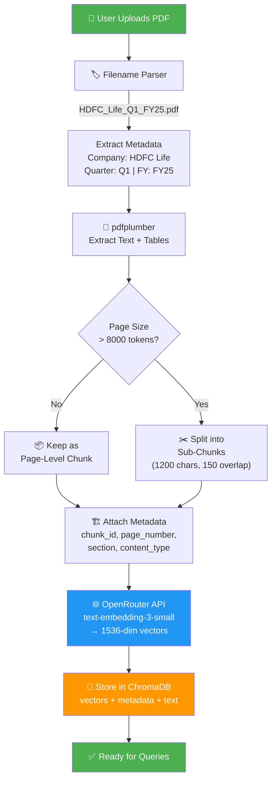
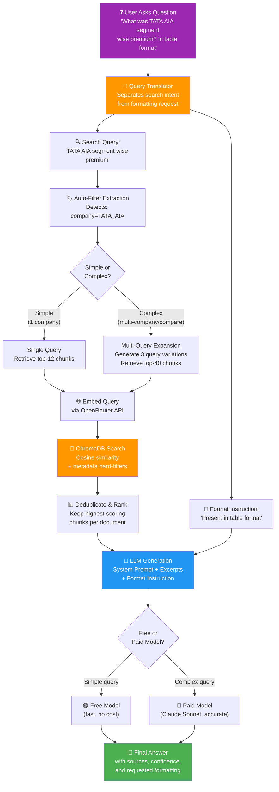

# Life Insurance Public Disclosure — RAG Analyzer

**RAG-Based Multi-Company Financial Report Analyzer**

> Author: Sombir  
> Stack: Python · OpenRouter API · ChromaDB · Streamlit · pdfplumber

---

## What This System Does

Ingests IRDAI Public Disclosure (PD) PDF reports from multiple life insurance companies across multiple quarters, extracts and indexes content using RAG, and answers plain English questions across all companies and time periods simultaneously.

### Example Questions

- Which company had the highest total premium in Q2 FY2025?
- What was LIC's gross written premium in Q1 FY2025 in crore?
- Compare persistency ratio of HDFC Life vs SBI Life for Q3 FY2025
- Which company had the lowest claim settlement ratio this quarter?
- Show channel-wise new business premium ranking for all companies
- What was the total industry new business premium for Q2 FY2025?

---

## Quick Start

### 1. Install Dependencies

```bash
pip install -r requirements.txt
```

**Requirements:**
- Python 3.10+
- All dependencies listed in `requirements.txt`

### 2. Configure Environment

```bash
# Copy example env file
copy .env.example .env

# Edit .env and add your OPENROUTER_API_KEY
# Get your API key from: https://openrouter.ai/keys
```

**Required settings in `.env`:**
- `OPENROUTER_API_KEY` - Your OpenRouter API key (required)
- Other settings have sensible defaults

### 3. Add PDF Files

Place your IRDAI Public Disclosure PDF files in `data/pdfs/` following the naming convention:

**Format:** `{COMPANY_CODE}_{QUARTER}_{FY}.pdf`

**Examples:**
```
data/pdfs/HDFC_Life_Q1_FY25.pdf
data/pdfs/SBI_Life_Q1_FY25.pdf
data/pdfs/LIC_Q1_FY25.pdf
data/pdfs/ICICI_Pru_Q2_FY25.pdf
```

### 4. Ingest PDFs

```bash
python scripts/ingest_all.py
```

This will:
- Parse all PDFs in `data/pdfs/`
- Extract text and tables
- Create chunks with metadata
- Generate embeddings
- Store in ChromaDB

### 5. Test from CLI

```bash
python scripts/test_query.py --q "Which company had highest GWP in Q1 FY25?"
```

### 6. Launch Web UI

```bash
streamlit run app/streamlit_app.py
```

Opens at `http://localhost:8501`

---

## Project Structure

```
insurance_rag/
├── .env                          # Configuration (API keys, settings)
├── .env.example                  # Template for .env
├── requirements.txt              # Python dependencies
├── README.md                     # This file
│
├── data/
│   ├── pdfs/                     # Raw PDF files go here
│   └── processed/                # Extracted JSON (auto-generated)
│
├── vectordb/                     # ChromaDB storage (auto-generated)
│
├── src/
│   ├── config.py                 # Load settings from .env
│   ├── pdf_parser.py             # Extract text + tables from PDFs
│   ├── chunker.py                # Split content into chunks
│   ├── embedder.py               # Create embeddings, manage ChromaDB
│   ├── retriever.py              # Search ChromaDB
│   ├── llm_client.py             # Claude API wrapper
│   ├── rag_pipeline.py           # Orchestrate retrieval + LLM
│   └── ingestor.py               # End-to-end ingestion pipeline
│
├── app/
│   └── streamlit_app.py          # Web UI
│
├── scripts/
│   ├── ingest_all.py             # Batch ingest all PDFs
│   └── test_query.py             # CLI query testing
│
└── Project_Files/                # Documentation
    ├── 01_project_overview.md
    ├── 02_folder_structure.md
    ├── 03_env_config.md
    └── ... (complete specs)
```

---

## Features

### 🔍 Multi-Company Queries
Ask questions across all indexed companies simultaneously. The system automatically aggregates and compares data.

### 📊 Time-Series Analysis
Compare metrics across quarters and financial years. Track trends and changes over time.

### 🎯 Smart Filtering
Filter queries by company, quarter, or financial year. Get focused answers for specific contexts.

### 📈 Table Extraction
Accurately extracts and indexes tables from PDFs. Preserves structure for numerical queries.

### 🤖 RAG-Powered
Uses Retrieval-Augmented Generation for accurate, source-cited answers. No hallucinations.

### 💾 Local Storage
All data stored locally in ChromaDB. No external database required.

---

## Technology Stack

| Component | Technology | Why |
|-----------|-----------|-----|
| LLM | OpenRouter (Claude/Gemini/DeepSeek) | Two-tier: free for simple, paid for complex |
| Vector DB | ChromaDB | Simple, local, no server setup |
| Embeddings | OpenRouter API (text-embedding-3-small) | High accuracy, no local GPU needed |
| PDF Parser | pdfplumber | Best for table extraction |
| Web UI | Streamlit | Fast prototyping, no frontend code |
| Config | python-dotenv | Clean environment management |

---

## System Workflow

### 📥 Pipeline 1: PDF Ingestion (How It Consumes PDFs)



### 💬 Pipeline 2: Query Answering (How It Answers Users)



## Usage Examples

### CLI Queries

```bash
# Basic question
python scripts/test_query.py --q "What was HDFC Life's GWP in Q1 FY25?"

# With company filter
python scripts/test_query.py --q "What was the claim settlement ratio?" --company HDFC_Life

# With time filter
python scripts/test_query.py --q "Show new business premium" --quarter Q1 --fy FY25

# Debug mode (show retrieved chunks)
python scripts/test_query.py --q "Compare persistency ratios" --debug
```

### Re-indexing

```bash
# Re-index all files (force)
python scripts/ingest_all.py --force

# Ingest from custom directory
python scripts/ingest_all.py --dir /path/to/pdfs
```

---

## File Naming Convention

**Critical:** Files must follow this exact format:

```
{COMPANY_CODE}_{QUARTER}_{FY}.pdf
```

**Valid company codes** (add more in `.env`):
- `LIC` - Life Insurance Corporation of India
- `HDFC_Life` - HDFC Life Insurance
- `SBI_Life` - SBI Life Insurance
- `ICICI_Pru` - ICICI Prudential Life Insurance
- `Max_Life` - Max Life Insurance
- `Bajaj_Life` - Bajaj Allianz Life Insurance
- `Kotak_Life` - Kotak Mahindra Life Insurance
- `Tata_AIA` - Tata AIA Life Insurance

**Valid quarters:** `Q1`, `Q2`, `Q3`, `Q4`

**Valid FY format:** `FY25`, `FY26`, etc.

---

## Configuration

All settings in `.env` file. Key settings:

```env
# Required
OPENROUTER_API_KEY=sk-or-xxxxx

# Optional (have defaults)
LLM_MODEL_FREE=anthropic/claude-3-haiku:free
LLM_MODEL_PAID=anthropic/claude-sonnet-4-5
CHUNK_SIZE=1200
TOP_K_SIMPLE=12
SIMILARITY_THRESHOLD=0.20
```

See `.env.example` for complete list.

---

## Troubleshooting

### No data in ChromaDB
```bash
# Check if files are ingested
python scripts/ingest_all.py

# Verify collection stats
python -c "from src.embedder import get_collection_stats; print(get_collection_stats())"
```

### API Key Error
```bash
# Verify API key is set
python -c "from src.config import OPENROUTER_API_KEY; print('OK' if OPENROUTER_API_KEY else 'NOT SET')"
```

### PDF Parsing Error
```bash
# Test single PDF
python src/pdf_parser.py data/pdfs/HDFC_Life_Q1_FY25.pdf
```

### Filename Format Error
Ensure files follow exact naming convention:
- Use underscores, not spaces or hyphens
- Quarter must be Q1, Q2, Q3, or Q4
- FY must be FY25, FY26, etc.
- Company code must be in COMPANY_CODES list in .env

---

## Documentation

Complete documentation in `Project_Files/`:

| File | Description |
|------|-------------|
| [01_project_overview.md](./Project_Files/01_project_overview.md) | Scope, goals, tech stack |
| [02_folder_structure.md](./Project_Files/02_folder_structure.md) | Full project directory layout |
| [03_env_config.md](./Project_Files/03_env_config.md) | Complete .env file with all settings |
| [04_file_naming.md](./Project_Files/04_file_naming.md) | PDF file naming convention |
| [05_data_schema.md](./Project_Files/05_data_schema.md) | Data extracted from PD reports |
| [06_chunk_metadata.md](./Project_Files/06_chunk_metadata.md) | ChromaDB chunk metadata schema |
| [07_modules.md](./Project_Files/07_modules.md) | All module descriptions |
| [08_system_prompt.md](./Project_Files/08_system_prompt.md) | Claude system prompt |
| [09_example_qa.md](./Project_Files/09_example_qa.md) | Example questions and answers |
| [10_streamlit_ui.md](./Project_Files/10_streamlit_ui.md) | Streamlit app views |
| [11_requirements.md](./Project_Files/11_requirements.md) | Python dependencies |
| [12_setup_steps.md](./Project_Files/12_setup_steps.md) | Step-by-step setup guide |
| [13_build_order.md](./Project_Files/13_build_order.md) | Build order for development |
| [14_limitations.md](./Project_Files/14_limitations.md) | Known limitations |

---

## License

This project is for educational and research purposes.

---

## Author

**Sombir**

For questions or issues, please refer to the documentation in `Project_Files/`.
